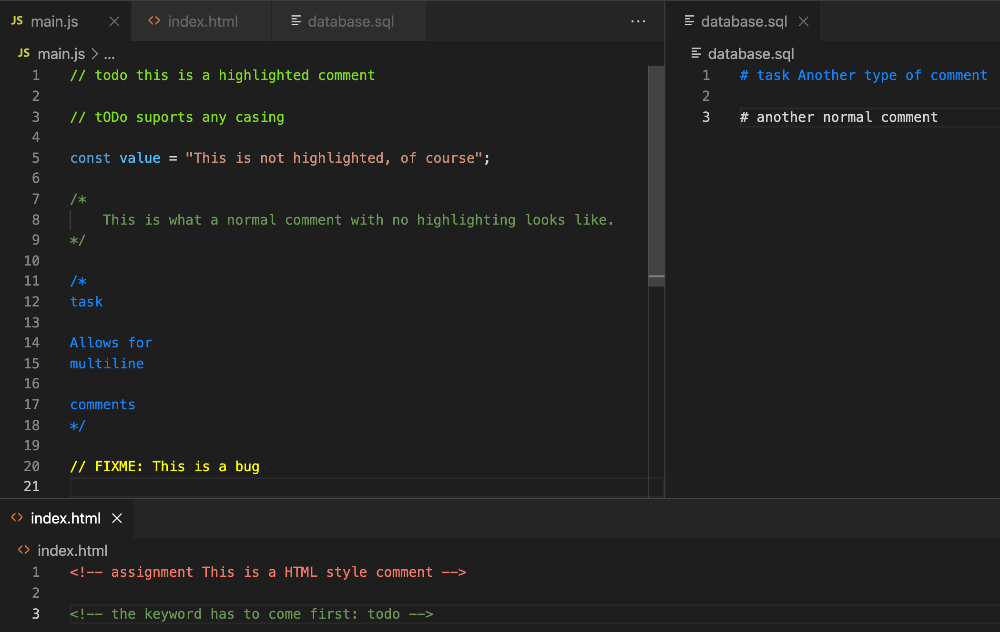

# vscode-todo-highlighter

Highlight comments based on certain keywords.

## Features

Highlight comments with the keywords: todo, fixme, assignment and task. 

## Extension Settings

Change the configurations through the  `contributes.configuration` extension point.

You can change the decoration style for a specific comment type like this: 

* `todoHighlighter.decorations.todo`: `{color: "#fff", backgroundColor: "rgba(0, 0, 0, 0.28)}`

## Report Issues / See Source Code

https://github.com/anderslatif/vscode-todo-highlighter

## Release Notes

### 0.0.1

Initial release of vscode-todo-highlighter

